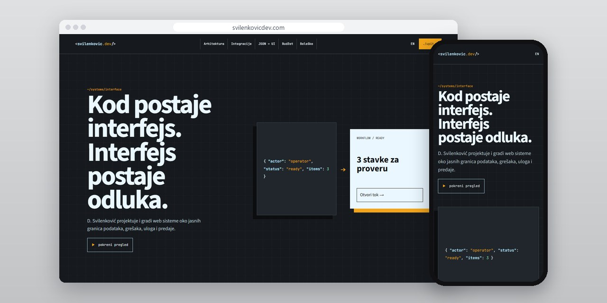
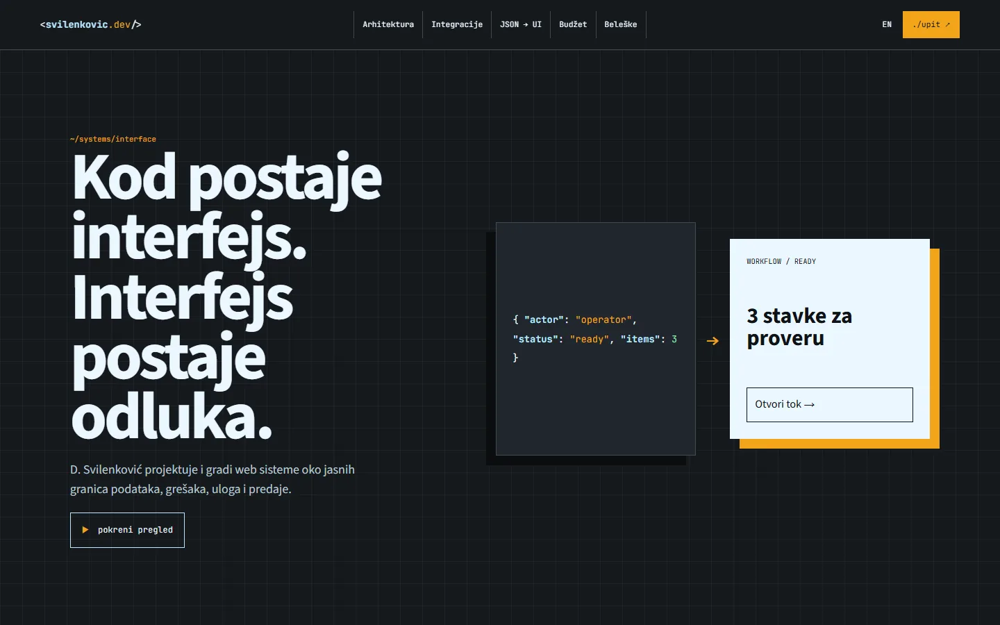
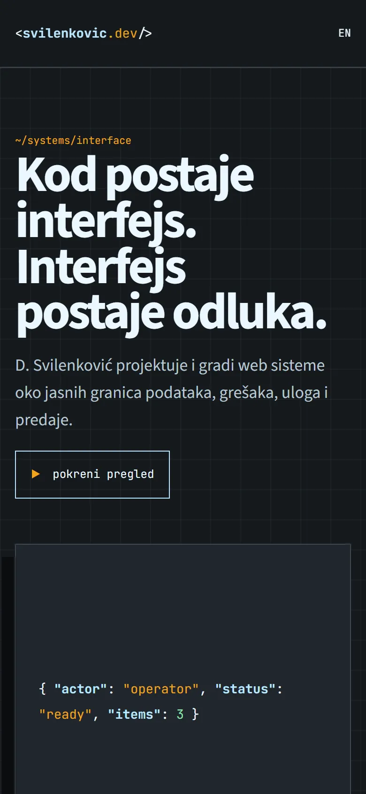
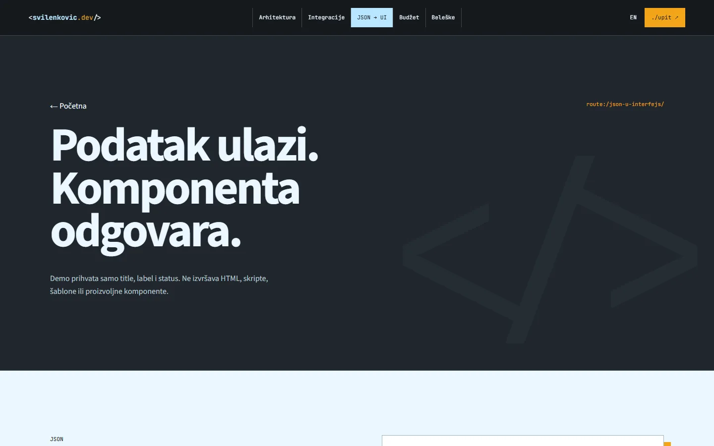

# Svilenković Dev

An engineering site about the path from data to screen: what a person sees when a field is missing, a response is late or a choice is due.

**[svilenkovicdev.com](https://svilenkovicdev.com/)** · [Case study (in Serbian)](https://svilenkovic.rs/radovi/svilenkovic-dev) · [Srpski](README.sr.md)

> [!NOTE]
> My own project, not client work. The source code is private. This page describes what the site does and how it is built.

<table>
  <tr><td><b>Client</b></td><td>Own project</td></tr>
  <tr><td><b>Industry</b></td><td>Integrations and web engineering</td></tr>
  <tr><td><b>Location</b></td><td>Serbia</td></tr>
  <tr><td><b>Type</b></td><td>Multi-page website</td></tr>
  <tr><td><b>My role</b></td><td>Research, design, development, SEO and hosting</td></tr>
  <tr><td><b>Stack</b></td><td>Astro 7, TypeScript, PHP 8.3, SQLite, nginx</td></tr>
</table>

## About the project

Code that reads data successfully is only the start. The next question is what a person sees when a field is missing, when a response is slow and when they have to make a decision. Svilenković Dev is about that part of development.

The main scene shows a data structure turning into an interface component; the animation stresses the order of processing, but the content reads fine without it. The JSON-to-interface example takes a small, defined input and is labelled as an example, not as a tool for any input. Next to it, a transfer budget example is a reminder that the size of a response costs the user something.

## What I built

- A JSON-to-interface example with a clearly limited input format
- A transfer budget page and technical notes
- Pages that keep system architecture and integrations apart from the look of a single screen
- A case study of search and the catalogue at Auto Delovi RM
- A code-to-interface scroll scene that the text does not depend on

## Results

| | Performance | Accessibility | Best practices | SEO |
| :-- | :-: | :-: | :-: | :-: |
| Mobile | 100 | 100 | 100 | 100 |
| Desktop | 100 | 100 | 100 | 100 |

PageSpeed Insights, lab test of the live site, October 2026. Security headers: 6 of 6. axe accessibility check: no violations. Structured data: `Organization`, `Person`.

## Screenshots

<table>
  <tr>
    <td width="68%" valign="top"></td>
    <td width="32%" valign="top"></td>
  </tr>
</table>

JSON to interface example on the live site

---

Built by [D. Svilenković](https://svilenkovic.com).
